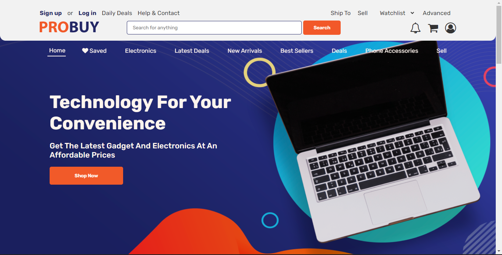

# ProBuy | Ecommerce Product

This is a solution to [Genesys Upskill Project for Group 16](https://obifaith.github.io/PROBUY/). **ProBuy** is a Business to Business *(B2B)* Ecommerce Website that allow users to buy and sell electronic gadgets easily anywhere, anytime.

## Table of Content
- [ProBuy | Ecommerce Product](#probuy--ecommerce-product)
  - [Table of Content](#table-of-content)
  - [Overview](#overview)
    - [The challenge](#the-challenge)
    - [Screenshot](#screenshot)
    - [Page Links](#page-links)
  - [Process](#process)
    - [Built with](#built-with)
  - [Team](#team)
    - [Product Designer](#product-designer)
    - [Web Dveloper](#web-dveloper)
  - [Acknowledgement](#acknowledgement)

## Overview

### The challenge 
Users should be able to:

- View the optimal layout for the site depending on their device's screen size
- User friendly and Able to navigate among the webpages
- Transitions and User Interactions

### Screenshot
  

### Page Links
- [PROBUY | Homepage](https://obifaith.github.io/PROBUY/)
- [Product page | PROBUY](https://obifaith.github.io/PROBUY/product.html)
- [Checkout page | PROBUY](https://obifaith.github.io/PROBUY/checkout.html)
- [Summary page | PROBUY](https://obifaith.github.io/PROBUY/summary.html)
- [Sign Up page | PROBUY](https://obifaith.github.io/PROBUY/summary.html)
- [Login page | PROBUY](https://obifaith.github.io/PROBUY/summary.html)

## Process

### Built with
- Semantic HTML5 markup
- CSS 3
- CSS Transition and Animations
- Flexbox
- CSS Grid
- Mobile-first workflow
- JavaScript

<!-- ### What we learned

#### Product Designer
- 

#### Web Developer
- 

### Useful Resources
- [Link1]() -->

## Team 

### Product Designer
- [Otu Chidiebere](https://twitter.com/Eldante0)
- [Amarachi Chukwu]()
- [Okafor Mary]()
  
### Web Dveloper
- [Obi Faith](https://github.com/ObiFaith/)
- [Charles Obimnaeto](https://github.com/IamNaeto)
- [Igwe David](https://github.com/Igwedave)

## Acknowledgement

I will like to thank every member of the team for their effort for making this project a success and Our Supervisors, **Mr Reuben Odirichukwu** (Web Developer) and **Mr Victor Ogbukaa** (Product Designer)

As the Team Lead, I am happy working with you all. Thank you.